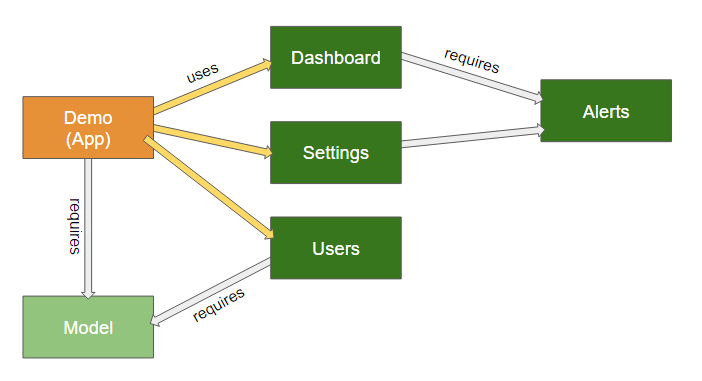

# MultiPackageDemo

This example demonstrates how to use
[Sencha Cmd 6.5+](https://www.sencha.com/products/sencha-cmd) and
[Ext JS 6.5+](https://www.sencha.com/products/extjs) to create an application that
consists of independently built, dynamically loaded packages.

This mock application uses packages in real-world ways to show how to use the same
techniques in your applications.

Following is a diagram of this application and its packages:



## Setup

To get started, you'll need to follow these steps:

- Install [Sencha Cmd](https://www.sencha.com/products/sencha-cmd)
- Download [Sencha Ext JS](https://www.sencha.com/products/extjs). We
  recommend extracting Ext JS into a `"sencha-sdks"` folder in your home directory.
- Setup the framework for the application
```
    $ sencha workspace install ~/sencha-sdks
```
- Alternatively, you can specify the framework directly with:
```
    $ sencha workspace install --framework=/absolute/path/to/framework
```

On Windows the "~" part of the path will be replaced by something like "C:\Users\Me\".

## Model

This package contains the data model of the application. In a traditional application
the classes in this package would be in the `'app/model'` and `'app/store'` folders.
These pieces are factored out of the application proper because other packages are
likely to reference them. The application simply `requires` them in its `'app.json'`
and is otherwise unaffected.

## Dashboard & Settings

These packages are listed in the `uses` of the application's `'app.json'` file and
as such are not loaded until requested. These are just placeholders for real content.

The code used to load such packages looks like the following:

    Ext.Package.load('Dashboard').then(function () {
    
        // the classes in the package are available...
        
    });

## Users

This is also a placeholder but shows how a package can manage its own styling and
resources.

### Styling

The styles are contained in files that correspond to JavaScript files. In this package,
`'src/Main.scss'` contains the styles needed by `'src/Main.js'` (the package's main view).

### Resources

The `'resources'` folder contains an `'avatars'` subfolder with some images. The URL's
to these can be resolved using `Ext.getResourcePath` or `Ext.resolveResource`, but in
the `'src/Main.js'` file, its `tpl` uses the `resources` formatter:

    tpl: 'avatars/")}">' +

These techniques are extremely helpful when dealing with path differences in development
versus production builds.

## Alerts

This package is in the `requires` of the `Dashboard` and `Settings` packages but is
unknown directly by the `Demo` application. This situation is common to large scale
projects where the application core is quite small.

The important thing to understand about this arrangement is that `Ext.Package.load()` is
a "transitive" process. In other words, when the application loads `Dashboard` as shown
below, more steps are taken internally to satisfy its dependencies.

    // This is the package the app wants to use:
    Ext.Package.load('Dashboard').then(function () {
        // ...
    });

When the above is called, the `load()` method will effectively do the following:

    return Ext.Package.load('Alerts').then(function () {
        return Ext.Package.load('Dashboard');
    });

That is, the `Alerts` package dependency will be handled prior to loading the `Dashboard`
package. The application does not need to manage this situation.


## Build

Used packages are built as stand-alone bundles that are dynamically loaded at runtime.  To
build the set of all used packages during an application build, use the `-uses` argument
to app build.

    $ sencha app build -uses ...

Builds of used packages are placed into sub-directories of the main application build 
directory. Consequently, builds of different build environments should be 'initialized' 
with the set of used packages that are not under active development.

    $ sencha app build -dev -uses ...

That will run a development build sweep of all used packages and initialize the development
build directory with the set of used package builds.  This will typically only need to 
happen once for packages that are not under active development

The build environment (production, testing, development) of the used packages defaults
to the build environment used to build the main application, but may be controlled 
independently by using the `-pkgtesting`,`-pkgproduction` or `-pkgdevelopment` arguments

    $ sencha app build -pkgtesting -dev
    
For packages that are under active development, rebuilds will be needed to pick up changes
/ additions / deletions to the package contents.  To rebuild specific packages, use the 
`-packages` argument to app build to list the set of packages to be rebuilt.

    $ sencha app build -packages Alerts,Users,...
     
To load a specific package or set of packages in application dev mode for inclusion by 
app watch, use the `-packages` argument to app watch to specify the set of packages to 
include in the watch process.
    
    $ sencha app watch -packages Alerts
